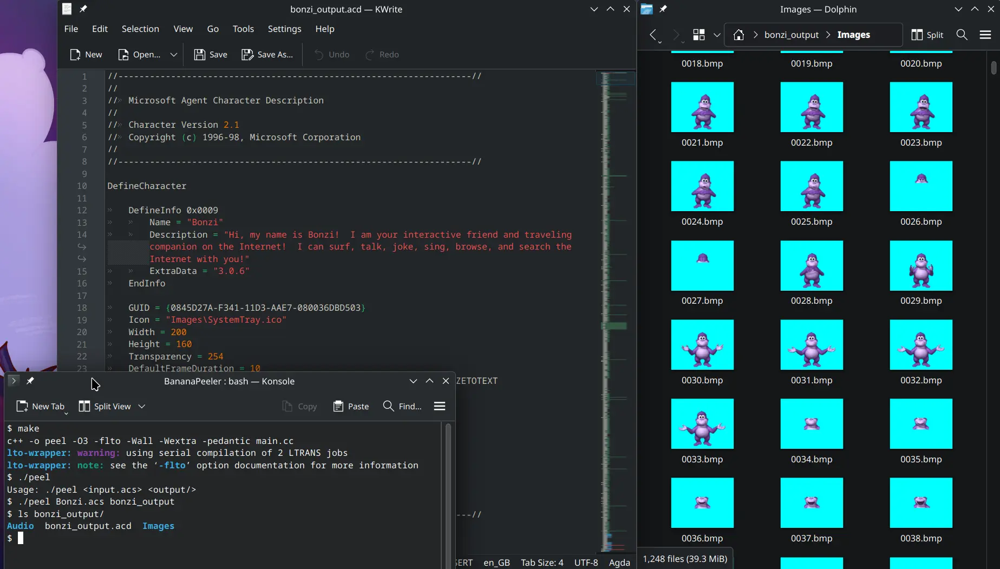

# BananaPeeler

Cross-platform Microsoft Agent extractor based on the [specification published by Lebeau Software](MSAgentDataSpecification_v1_6.htm). The output format also aims to be similar to that of [MSAgent Decompiler by Lebeau Software](https://archive.org/details/msagent-decompiler).

## Usage

```
Usage: ./peel <input.acs> <output/>
```

## Demo


